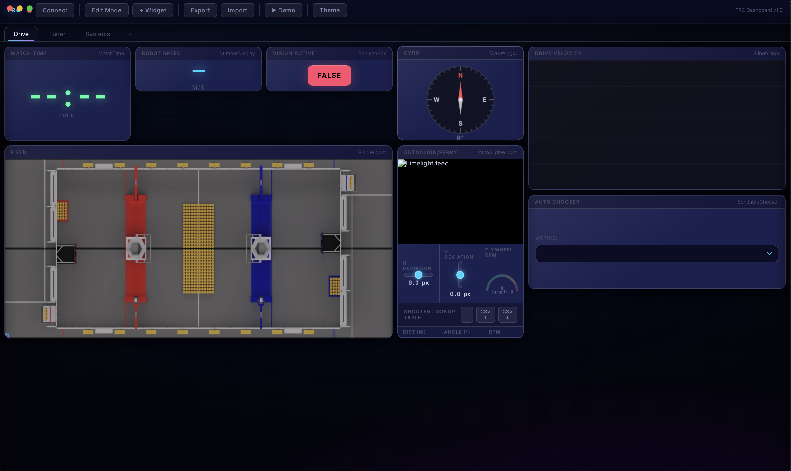

# Voxel

A full-featured FRC driver-station dashboard built in [Haxe](https://haxe.org/), compiling to JavaScript for the browser (or Electron). Real-time robot telemetry via the **NT4 WebSocket protocol**, glassmorphism UI, and a custom **AutoAlign / Ferry** composite widget with Limelight camera feed, path overlay, RPM gauge, and an editable shooter lookup table that writes back to NetworkTables.

---

## Screenshots



## Prerequisites

| Tool | Version | Install |
|------|---------|---------|
| **Haxe** | 4.3+ | https://haxe.org/download/ |
| **haxelib** | bundled with Haxe | run `haxelib setup` once |
| A web browser | any modern | Chrome/Firefox/Edge |
| *(optional)* Node + npm | any | for a local dev-server |
| *(optional)* HashLink | 1.14+ | https://hashlink.haxe.org/ (HL target only) |

> **macOS shortcut** (Homebrew):
> ```bash
> brew install haxe
> ```

---

## Quick Start

```bash
# 1. Clone / navigate to the project
cd ~/Developer/frc-haxe-dashboard

# 2. First-time: set up haxelib repository
haxelib setup           # press Enter for the default path

# 3. Build the JavaScript bundle
haxe build.hxml         # → bin/dashboard.js

# 4. Serve and open
# Option A – Python one-liner (no install needed)
python3 -m http.server 8080
# then open http://localhost:8080

# Option B – Node serve
npx serve .
# then open the printed URL
```

> **Do NOT open `index.html` directly as a `file://` URL** — the browser will
> block XHR requests used to load the default layout and field image. Use any
> HTTP server.

---

## Building

### JavaScript (primary)

```bash
haxe build.hxml
```

Produces `bin/dashboard.js` (~144 KB minified). All logic is target-agnostic
Haxe; only the WebSocket and DOM APIs are JS-specific.

**build.hxml**
```hxml
-cp src
-js bin/dashboard.js
-main Main
-D analyzer-optimize
```

### HashLink (secondary, native desktop)

```bash
haxelib install heaps
haxelib install haxeui-core
haxelib install haxeui-heaps
haxe build-hl.hxml      # → bin/dashboard.hl
hl bin/dashboard.hl
```

> HashLink uses `haxeui-heaps` for rendering instead of the DOM; the core
> logic (NT4, MsgPack, TopicStore, all widgets) is shared unchanged.

---

## Connecting to the Robot

1. Click **Connect** in the toolbar (or press **Ctrl+E** to toggle edit mode
   then click the indicator).
2. In the connection dialog enter either:
   - **Team number** (e.g. `254`) — auto-expands to `10.2.54.2`
   - **IP address** — e.g. `10.25.14.2`, `192.168.0.2`
   - **`localhost`** — tick the *Simulation* checkbox
3. **Port** defaults to `5810` (NT4). Change if your robot uses a custom port.
4. Click **Connect**. The green pulsing dot in the toolbar confirms the link.

The connection is persisted in `localStorage` and restored on reload.

---

## Robot-side Setup

The dashboard speaks **NT4 over WebSocket** (`ws://<ip>:5810/nt/<identity>`
with subprotocol `networktables.first.wpi.edu`). Any WPILib 2024+ robot
running `NetworkTableInstance.getDefault()` works out of the box.

### Required NT topics (default layout)

| Widget | Topic | Type |
|--------|-------|------|
| MatchTime | `/DriverStation/MatchTime` | `double` |
| FieldWidget | `/AdvantageKit/RealOutputs/Odometry/RobotPose` | `double[]` `[x, y, θ°]` |
| GyroWidget | `/AdvantageKit/RealOutputs/Drive/GyroYawDeg` | `double` |
| H Deviation | `/AutoAlign/HDeviation` | `double` |
| V Deviation | `/AutoAlign/VDeviation` | `double` |
| Flywheel RPM | `/Shooter/FlywheelRPM` | `double` |
| RPM Target | `/Shooter/TargetRPM` | `double` |
| Shooter Table | `/SmartDashboard/ShooterTable` | `string` (JSON) |
| Path Points | `/AutoAlign/PathPoints` | `double[]` |
| Auto Chooser | `/SmartDashboard/Auto Chooser` | NT Sendable |

All topics are configurable per-widget via right-click → **Properties**.

---

## Layout System

Feature parity with Elastic Dashboard:

| Feature | Status | Notes |
|---------|--------|-------|
| Drag & drop | ✅ | Ghost clone follows cursor; snaps to grid on release |
| Drop preview | ✅ | Cyan dashed overlay shows target cell(s) while dragging |
| Collision detection | ✅ | Blocked drops flash red and return tile to origin |
| Resize | ✅ | Drag `⤢` grip; colspan/rowspan update live |
| Cell dimension measurement | ✅ | Reads from actual tile rects; falls back to `grid-auto-rows` |
| Multiple tabs | ✅ | Click `+`; double-click to rename |
| Add / remove widgets | ✅ | Widget picker sidebar + right-click → Remove |
| Layout persist | ✅ | Auto-saved to `localStorage` on every change |
| Import / Export JSON | ✅ | Toolbar buttons |
| Widget properties | ✅ | Right-click → Properties panel |
| Dark / light theme | ✅ | Toolbar button |
| Undo / redo | ❌ | Not implemented |
| Tab reorder | ❌ | Not implemented |

- **12-column CSS grid** with `grid-auto-rows: 90px` fixed row height.
- **Edit mode** (toolbar button or `Ctrl+E`):
  - Drag tiles by the `≡` handle in their header.
  - Resize from the `⤢` grip in the bottom-right corner.
  - Right-click any tile for Duplicate / Remove / Configure NT.
- **Multiple tabs** — click `+` in the tab bar; double-click a tab to rename.
- **Import / Export** buttons serialize the layout to JSON you can version-control.
- Layout is auto-saved to `localStorage` key `frc-dash-layout` on every change.

### Default layout file

`layouts/default.json` is loaded on first run (no saved layout in
`localStorage`). Edit it to change the out-of-box experience. Tile schema:

```jsonc
{
  "type": "NumberDisplay",   // widget type name
  "col": 3,  "row": 1,       // 1-based grid position
  "colspan": 2, "rowspan": 1,
  "props": {
    "title": "Robot Speed",
    "topic": "/Drive/SpeedMetersPerSec",
    "unit": "m/s",
    "decimals": 2
  }
}
```

---

## Widget Reference

### Standard widgets

| Type | Key props | NT type |
|------|-----------|---------|
| `NumberDisplay` | `topic`, `decimals`, `unit` | `double` |
| `TextDisplay` | `topic`, `wordWrap` | `string` |
| `BooleanBox` | `topic`, `trueColor`, `falseColor`, `trueLabel`, `falseLabel` | `boolean` |
| `ToggleButton` | `topic` | `boolean` (publishes on click) |
| `LineGraph` | `topic`, `windowSec` (default 10) | `double` |
| `Gauge` | `topic`, `min`, `max`, `unit` | `double` |
| `GyroWidget` | `topic` | `double` (degrees) |
| `FieldWidget` | `topic`, `alliance` (`blue`/`red`) | `double[]` `[x, y, θ]` |
| `CameraStream` | `topic` or `url` | `string` (MJPEG URL) |
| `SendableChooser` | `topic` (base path) | NT Sendable |
| `MatchTime` | `topic`, `warningThreshold`, `dangerThreshold` | `double` |
| `SubsystemWidget` | `topic` (prefix, e.g. `/LiveWindow`) | NT Sendable tree |
| `CommandScheduler` | `topic` (e.g. `/Scheduler`) | `string[]` |
| `PowerDistribution` | `topic` (e.g. `/PowerDistribution`), `maxCurrent` | `double` per channel |

### AutoAlign / Ferry widget (`AutoAlignWidget`)

The three-pane composite widget — configure all props via right-click → Properties:

| Prop | Default | Description |
|------|---------|-------------|
| `cameraUrl` | `""` | MJPEG stream URL (e.g. `http://limelight.local:5800/stream.mjpeg`) |
| `hDeviationTopic` | `/AutoAlign/HDeviation` | Horizontal deviation in pixels |
| `vDeviationTopic` | `/AutoAlign/VDeviation` | Vertical deviation in pixels |
| `rpmTopic` | `/Shooter/FlywheelRPM` | Actual flywheel RPM |
| `rpmTargetTopic` | `/Shooter/TargetRPM` | Target RPM |
| `shooterTableTopic` | `/SmartDashboard/ShooterTable` | JSON string `[{dist, angle, rpm}, …]` |
| `pathTopic` | `/AutoAlign/PathPoints` | Path point array (see `pathMode`) |
| `pathMode` | `pixels` | One of `pixels`, `fieldspace`, `trajectory` |

#### Path projection modes

| Mode | `pathMode` value | NT payload |
|------|-----------------|------------|
| **Pre-projected pixels** | `pixels` | `double[]` `[px0,py0, px1,py1, …]` at camera native res |
| **Field-space (m)** | `fieldspace` | `double[]` `[x0,y0, x1,y1, …]` in field metres; needs homography H calibrated in Properties |
| **WPILib Trajectory JSON** | `trajectory` | `string` — standard WPILib `Trajectory` JSON, sampled at 0.1 s intervals |

#### Shooter lookup table

- Rows are sorted by distance automatically.
- **Double-click** any cell to edit inline; press Enter or click away to commit.
- Changes are **immediately published** to `shooterTableTopic` as a JSON string.
- **CSV ↑** exports the current table; **CSV ↓** imports a CSV and publishes it.

Robot-side parser example (Java):
```java
String json = SmartDashboard.getString("ShooterTable", "[]");
ShooterRow[] rows = new Gson().fromJson(json, ShooterRow[].class);
```

---

## Keyboard Shortcuts

| Shortcut | Action |
|----------|--------|
| `Ctrl+E` | Toggle edit mode |
| `Ctrl+Tab` | Next tab |
| `Ctrl+Shift+Tab` | Previous tab |

---

## Project Structure

```
frc-haxe-dashboard/
├── build.hxml            # JS build (haxe build.hxml)
├── build-hl.hxml         # HashLink build
├── index.html            # Browser entry point
├── bin/
│   └── dashboard.js      # Compiled output (gitignored)
├── src/
│   ├── Main.hx           # Entry point, wiring
│   ├── core/
│   │   ├── MsgPack.hx        # Pure-Haxe MessagePack encode/decode
│   │   ├── NT4Client.hx      # WebSocket NT4 protocol + auto-reconnect
│   │   ├── TopicStore.hx     # Local topic cache + subscriptions
│   │   └── AppState.hx       # Connection/theme/tab persistence
│   ├── layout/
│   │   ├── DashboardGrid.hx  # 12-column grid, tabs, drag/drop
│   │   ├── WidgetTile.hx     # Tile wrapper (drag, resize, context menu)
│   │   └── LayoutSerializer.hx
│   ├── ui/
│   │   ├── Toolbar.hx
│   │   ├── ConnectionDialog.hx
│   │   ├── WidgetPicker.hx
│   │   ├── PropertyPanel.hx
│   │   └── ThemeManager.hx
│   ├── widgets/
│   │   ├── Widget.hx          # Base class
│   │   ├── WidgetRegistry.hx  # Factory map
│   │   ├── NumberDisplay.hx … PowerDistribution.hx
│   │   └── autoalign/
│   │       ├── AutoAlignWidget.hx
│   │       ├── CameraOverlay.hx
│   │       ├── DeviationIndicator.hx
│   │       ├── FerryGauge.hx
│   │       ├── PathProjector.hx
│   │       └── ShooterLookupEditor.hx
│   └── util/
│       ├── EventBus.hx   # Typed pub/sub singleton
│       ├── MathUtil.hx   # Clamp, lerp, homography (DLT solver)
│       └── ColorUtil.hx  # HSV↔RGB, gradient, traffic-light
├── assets/
│   ├── field/
│   │   ├── 2025-reefscape.png    # Place your field image here
│   │   └── field-config.json
│   └── themes/
│       ├── dark.css      # Default: deep-space glassmorphism
│       └── light.css
└── layouts/
    └── default.json      # Out-of-box layout (loaded if localStorage is empty)
```

---

## Adding a Custom Widget

1. Create `src/widgets/MyWidget.hx` extending `Widget`:

```haxe
package widgets;

class MyWidget extends Widget {
    public function new(store, bus) {
        super(store, bus, "MyWidget");
        title = "My Widget";
    }

    override function buildDOM(container) {
        // build your DOM here
    }

    override public function configure(props) {
        super.configure(props);   // handles title + topic subscription
        // read extra props here
    }

    override public function onNTUpdate(topic, value) {
        // react to NT value changes
    }

    override public function serialize(): Dynamic {
        var o = super.serialize();
        // add your extra props
        return o;
    }
}
```

2. Register it in `WidgetRegistry.registerAll()`:

```haxe
register("MyWidget", (s, b) -> new MyWidget(s, b));
```

3. Rebuild: `haxe build.hxml`.
   The widget will appear in the **+ Widget** sidebar automatically.

---

## Troubleshooting

| Symptom | Fix |
|---------|-----|
| `haxelib` not found | Make sure the Haxe `bin/` is on `$PATH`; on macOS try `export PATH=/usr/local/bin:$PATH` |
| `dashboard.js` not found | Run `haxe build.hxml` — the `bin/` directory must exist (`mkdir -p bin`) |
| Dashboard loads but NT won't connect | Check robot is running WPILib 2024+; confirm IP; disable firewall on port 5810 |
| Field image not loading | Place `2025-reefscape.png` in `assets/field/` (a 1654×821 PNG works well) |
| Shooter table not writing | Ensure NT topic matches robot-side; confirm `publish` is called (check browser Network > WS) |
| CSS doesn't look right | Hard-refresh (`Ctrl+Shift+R`) to bust the CSS cache after a theme change |

---

## License

MIT — free to use, modify, and distribute. Built for the FRC community.
